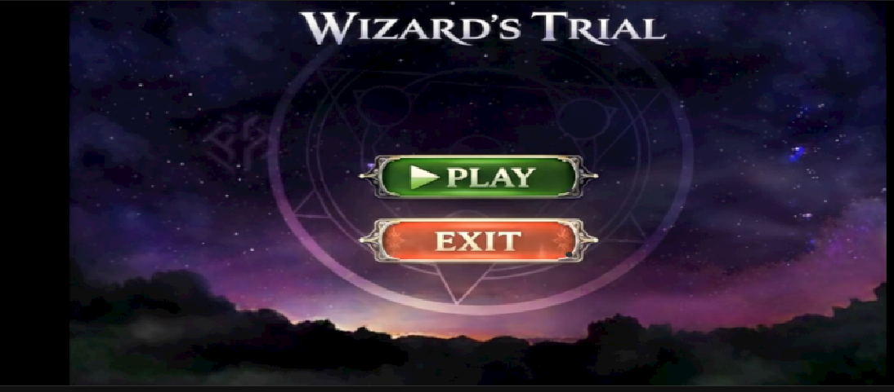
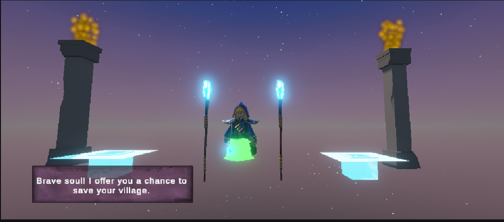
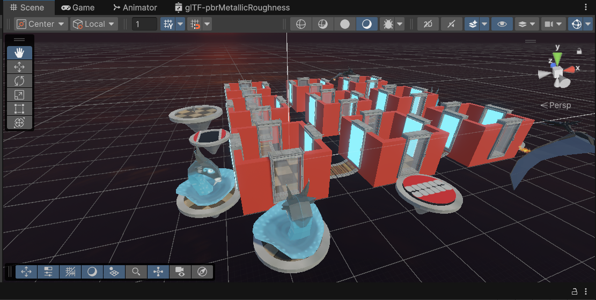
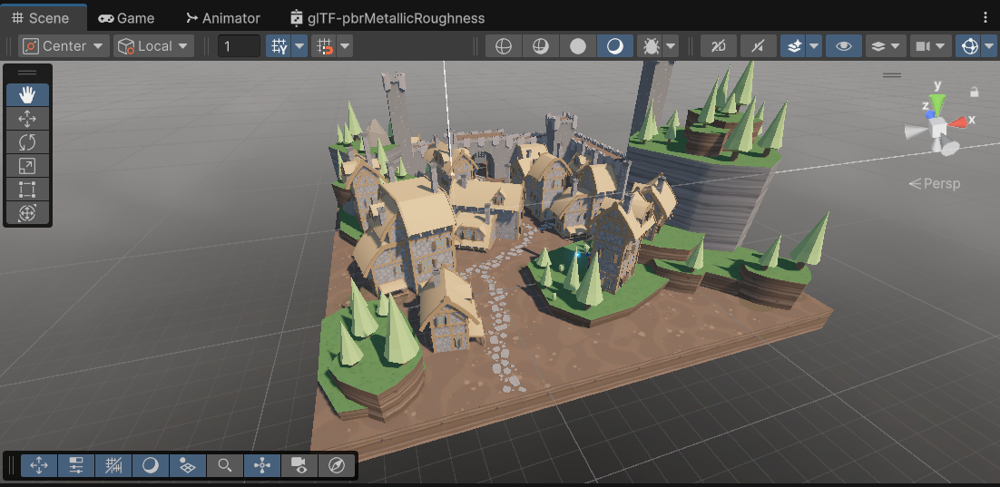

# Wizard’s Trial (Warrior in Woods) 🧙‍♂️💎


An atmospheric 3D adventure and puzzle game built using the latest **Unity 6** engine. Players must complete a high-stakes trial set by a mysterious Wizard, navigating mazes and villages under a strict time limit.

---

## 📸 Game Gallery

### The Main Menu

*The journey begins at the Wizard's Trial start screen.*

### The Wizard's Quest

*“Brave soul! I offer you a chance to save your village.”*

### The Maze Challenge

*A complex, high-walled maze that tests the player's navigation and memory.*

### The Village Environment

*A detailed 3D low-poly village where players must find 6 hidden iron ingots.*

---

## 🕹️ Gameplay & Mechanics

The game follows a structured objective-based loop:

1.  **The Dialogue Stage:** Players start by interacting with the Wizard to receive their quest.
2.  **The Maze Challenge:** Navigate a complex 3D maze to find the portal to the village.
3.  **The Scavenger Hunt:** In the village, players must locate and collect **6 Iron Ingots** scattered throughout the map.
4.  **The Extraction:** Once all ingots are collected, a secret door spawns, allowing the player to teleport back to the Wizard.
5.  **The Time Trial:** A constant **5-minute countdown** (05:00) adds pressure. Failure to complete the task results in a "Time's Up" game over.

---

## 🛠 Technical Specifications

### Development Environment
* **Game Engine:** Unity 6 (Version 6000.2.14f1)
* **Scripting Language:** C#
* **Rendering:** Universal Render Pipeline (URP)
* **Assets Used:** Low-poly Dungeons/Village kits, AllSkyFree (Skyboxes), Boxophobic shaders.

### Core Scripts & Systems
The project architecture is organized into several key modular scripts:

* **`WizardDialog.cs`**: Handles the NPC dialogue system and quest triggers.
* **`GameTimer.cs` & `TimerUI.cs`**: Manages the global 300-second countdown and real-time UI updates.
* **`Portal.cs` & `SimpleTeleport.cs`**: Logic for seamless scene transitions and player positioning.
* **`FallReset.cs` & `RespawnManager.cs`**: Safety systems to handle player boundaries and deaths.
* **`FloatingObj.cs`**: Provides visual feedback for collectible items (Ingots).

---

## 📂 Project Structure
```text
Assets/
├── Scenes/           # MainMenu, MazeScene, VillageScene, Win/Lose
├── Scripts/          # C# Logic (Teleportation, Timer, Dialogue)
├── Prefabs/          # Reusable GameObjects (Portals, Ingots, Player)
├── Mesh/             # 3D Models for Village and Maze
└── Resources/        # Audio and UI Assets
